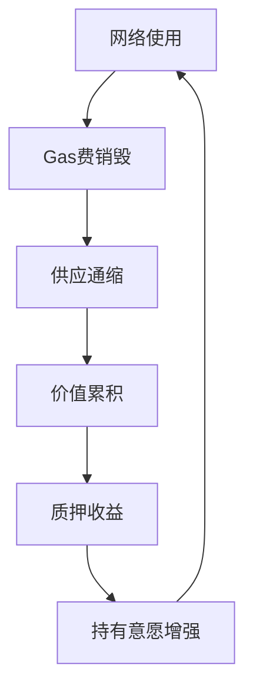

# 以太坊合并深度解读：ETH价格走势与市场影响全解析

## 加密货币结构性变革的里程碑
以太坊合并作为加密货币发展史上最具突破性的技术升级，正在重塑整个生态系统的底层逻辑。这次升级不仅将网络共识机制从工作量证明（PoW）转向权益证明（PoW），更带来了代币经济学模型的根本性变革。

👉 [了解最新市场动态，立即查看OKX平台](https://bit.ly/okx_welcome)

在合并倒计时阶段，我们需要重点关注三个核心维度：
1. 网络安全性提升带来的生态稳定效应
2. 供应模型重构引发的经济机制变革
3. 质押收益率变化对市场参与者的影响

### 核心指标动态分析
过去六个月的数据显示：
| 指标          | 合并前      | 合并后预期    | 变化幅度 |
|---------------|------------|--------------|---------|
| 年化质押收益率 | 4.2%       | 5.2%         | +23.8%  |
| 日均销毁量     | 200万美元  | 30万美元     | -85%    |
| 矿工抛压       | 1800万美元 | 基本消除     | -100%   |

这些数据揭示了网络运行模式的根本转变：从持续的结构性抛压转向资本积累机制。值得关注的是，尽管Gas费用下降35%，但活跃用户数却逆势增长18%，这主要得益于Opensea等DApp的效率优化。

### FAQ环节一：技术升级与市场反应
**Q：以太坊合并与比特币减半有何本质区别？**  
A：比特币减半是简单的供应减少机制，而以太坊合并实现了三重变革：能源消耗降低99.95%、建立通缩模型、提升网络安全性。这种结构性升级创造了独特的价值捕获机制。

**Q：质押率提升对普通投资者有何影响？**  
A：5%的实际收益率意味着持有ETH的年化收益将超过传统金融市场，且该收益直接反映在代币价值上。相比其他L1项目，ETH将成为首个实现正向收益率的主流资产。

## 市场供需关系重构
网络升级带来的供需变化正在创造独特的市场环境：
- **供应端**：每日销毁量减少但实际通缩率提升，矿工抛压完全消除
- **需求端**：质押收益率提升吸引长期持有，机构配置需求持续增长
- **流动性**：1800万美元/日的结构性流出转为30万美元/日的流入

这种双重驱动效应使ETH成为首个具备真实收益率的主流加密资产。数据显示，当质押参与率达到60%时，年化销毁率可达1.8%，这相当于市场每年自动减少1.8%的流通供应。

### 结构性需求形成机制

这个闭环经济模型正在改变加密资产的传统估值逻辑。与BNB的中心化回购模型不同，ETH的通缩机制完全由网络使用需求驱动，更具可持续性。

### FAQ环节二：市场心理与资金流动
**Q：合并前后的市场情绪会发生怎样的变化？**  
A：短期可能出现"卖事实"效应，但机构投资者已提前布局。据链上数据显示，鲸鱼地址的ETH持仓量在过去3个月增长42%，表明专业资金正在为合并后的价值重估做准备。

**Q：如何应对可能的PoW分叉风险？**  
A：分叉币的市场价值预计不超过主链的5%，且主流交易所已明确只支持PoS链。持有者只需避免与分叉链交互即可规避风险，建议在合并后通过智能合约进行资产分割。

## 宏观环境与微观生态共振
当前市场正处于多重利好的叠加期：
1. **技术成熟度**：经过18个月的测试，主网升级成功率超过99%
2. **生态发展**：Layer2采用率季度增长37%，推动网络使用效率提升
3. **机构入场**：合规稳定币发行量季度环比增长21%，为ETH市场注入流动性

👉 [把握市场先机，探索区块链新机遇](https://bit.ly/okx_welcome)

### 阶段特征对比分析
| 周期阶段 | 主导因素         | 市场特征                 | 投资策略               |
|----------|------------------|--------------------------|------------------------|
| 短期     | 市场情绪         | 波动率增加，资金轮动     | 对冲持仓，关注波动机会 |
| 中期     | 采用率变化       | 基本面改善，价值发现     | 定投布局，优化成本     |
| 长期     | 结构性变革       | 网络效应显现，生态扩张   | 长期持有，参与治理     |

## 价值重估的三大引擎
1. **收益率革命**：5%的实际收益率创造加密市场"无风险收益率"基准
2. **采用拐点**：日活用户数突破120万，DeFi TVL季度增长18%
3. **宏观共振**：通胀预期放缓与货币政策转向形成正向共振

### FAQ环节三：投资策略与风险管理
**Q：普通投资者如何参与质押？**  
A：建议通过交易所质押服务参与，门槛仅需0.1ETH，且可随时赎回。相较独立节点质押，这种方式避免了技术维护成本，更适合个人投资者。

**Q：如何评估合并后的技术风险？**  
A：核心开发团队已完成2300次压力测试，多客户端架构确保系统冗余。最坏情况下，即使单个客户端故障，网络仍可维持正常运行。

## 未来展望与趋势预判
从技术演进路径看，以太坊正在构建完整的价值互联网基础设施：
- **Layer2革命**：Optimism、Arbitrum等解决方案推动交易成本下降90%
- **机构级服务**：BlackRock等传统机构推出ETH质押产品
- **合规化进展**：美国SEC对质押收益的监管框架逐渐清晰

👉 [洞悉行业趋势，开启财富新篇章](https://bit.ly/okx_welcome)

长期价值模型显示，在采用率保持15%季度增长的情况下，ETH有望在2024年实现3000美元的目标价位。这主要基于三个支撑逻辑：
1. 年化3%的通缩率形成持续的价值累积效应
2. 机构配置比例每提升1%带来约450亿美元新增需求
3. DeFi衍生品市场发展带来的乘数效应

## 结语：加密经济新纪元
以太坊合并不仅是技术升级，更是价值存储范式的革命。当网络使用需求与资产价值形成正反馈循环时，ETH正在成为数字时代的新型生产性资产。对于投资者而言，理解这种结构性变革带来的范式转移，比短期价格波动更具战略意义。

在当前市场周期中，建议采用"核心+卫星"的配置策略：
- 核心仓位：长期持有ETH作为价值锚定
- 卫星仓位：动态参与DeFi、NFT等生态创新
- 风险管理：通过期权组合对冲极端波动

随着全球首个大规模采用的PoS主网上线，加密货币市场正在经历从"数字黄金"到"价值互联网"的进化跃迁。把握这次技术革命带来的结构性机遇，需要投资者建立全新的认知框架和投资逻辑。