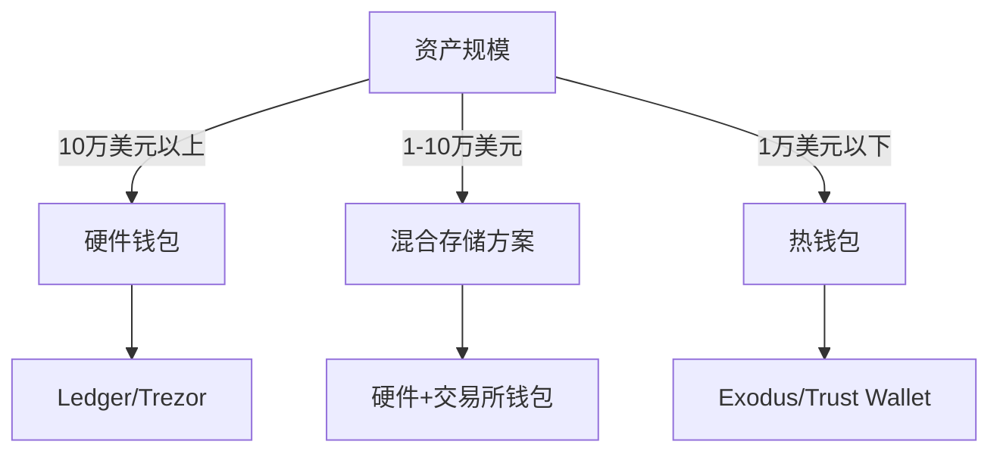

# 新手如何创建加密货币钱包指南

## 为什么需要加密货币钱包？

随着区块链技术的快速发展，加密货币已成为全球投资者关注的焦点。无论是进行日常交易还是长期投资，创建一个安全可靠的加密货币钱包都是参与数字资产生态的第一步。本文将为您详细解析加密货币钱包的类型选择、创建流程及安全存储技巧。

👉 [深入了解加密货币钱包安全机制](https://bit.ly/okx_welcome)

---

## 加密货币钱包的核心功能

加密货币钱包本质上是管理私钥的工具，其核心功能包括：
1. 存储数字资产（支持BTC、ETH等主流币种）
2. 签署交易（通过私钥验证所有权）
3. 与区块链网络交互（发送/接收加密货币）
4. 钱包备份与恢复（通过助记词实现）

---

## 钱包类型及适用场景对比

| 类型       | 安全等级 | 操作便捷性 | 适用人群          | 典型产品       |
|------------|----------|------------|-------------------|----------------|
| 硬件钱包   | ★★★★★    | ★★☆☆☆      | 长期持有者        | Ledger Nano X  |
| 软件钱包   | ★★★☆☆    | ★★★★☆      | 日常交易用户      | Exodus         |
| 网页钱包   | ★★☆☆☆    | ★★★★★      | 初学者            | Coinbase Wallet|
| 纸质钱包   | ★★★★☆    | ★☆☆☆☆      | 极客/冷存储需求者 | 自定义打印方案 |

---

## 创建钱包的6大核心考量因素

1. **安全机制**：是否支持多重验证、生物识别等安全功能
2. **币种兼容性**：支持的加密货币种类及扩展能力
3. **费用结构**：交易手续费、网络费及增值服务费用
4. **跨平台支持**：iOS/Android/桌面端的兼容性
5. **用户口碑**：在Trustpilot等平台的评分及用户评价
6. **客户服务**：7×24小时客服响应及知识库完善度

👉 [查看加密货币钱包费用对比表](https://bit.ly/okx_welcome)

---

## 硬件钱包创建全流程指南

### 第一步：选择硬件设备
推荐品牌对比：
- **Ledger Nano X**：支持1800+币种，内置蓝牙连接
- **Trezor Model T**：触摸屏设计，支持Shamir备份
- **KeepKey**：大屏显示私钥确认功能

### 第二步：初始化设备
1. 通过USB连接电脑/手机
2. 设置6位数以上PIN码
3. 记录12/24位助记词（建议使用金属备份）
4. 验证助记词顺序

### 第三步：资产转移
1. 在交易所选择「提币」功能
2. 扫描硬件钱包生成的收款二维码
3. 确认网络手续费（Gas Fee）
4. 等待区块确认（通常3-10分钟）

---

## 软件钱包创建注意事项

### 创建流程：
1. 从官网/应用商店下载安装包（警惕钓鱼链接）
2. 设置高强度密码（包含大小写字母+数字+符号）
3. 完成KYC验证（部分钱包强制要求）
4. 备份助记词（建议离线存储于保险柜）

⚠️ **安全提醒**：避免在公共WiFi环境下操作，定期更新钱包版本修复安全漏洞。

---

## 纸质钱包制作安全规范

### 制作步骤：
1. 使用离线设备生成密钥对（推荐[bitaddress.org](https://bitaddress.org)）
2. 双重校验公私钥匹配性
3. 采用防水防褪色墨水打印
4. 分割存储：公钥可公开，私钥需加密保存

🔍 **风险提示**：纸质钱包易受物理损坏，建议配合数字备份使用。

---

### 常见问题解答（FAQ）

**Q：冷钱包和热钱包的本质区别是什么？**  
A：冷钱包（硬件/纸质）离线存储私钥，安全性更高；热钱包（软件/网页）在线存储，便于频繁交易。

**Q：如何验证钱包的开源代码安全性？**  
A：可通过GitHub等平台查看代码审计报告，优先选择经CertiK等机构认证的钱包。

**Q：钱包丢失后如何恢复资产？**  
A：使用助记词在同类型钱包中恢复，注意：助记词不可逆且无法重置。

**Q：多签钱包的工作原理是什么？**  
A：需要多个私钥授权才能完成交易，典型应用如公司钱包的三级审批机制。

**Q：钱包支持质押功能需要注意什么？**  
A：确认质押资产的流动性要求，了解锁仓周期及收益结算方式。

---

## 主流钱包安全性能对比表

| 钱包类型     | 是否开源 | 多签支持 | 生物识别 | 交易所集成 | 年审计报告 |
|--------------|----------|----------|----------|------------|------------|
| Ledger Nano X| 是       | 支持     | 支持     | 支持       | 有（Kudelski审计）|
| Exodus       | 是       | 支持     | 部分支持 | 支持       | 有（独立审计）|
| Coinbase Wallet| 否     | 不支持   | 支持     | 深度集成   | 有（第三方审计）|

---

## 加密货币存储风险防范指南

### 三大主要风险：
1. **网络钓鱼攻击**：2023年Q2数据显示，32%的被盗资产源于钓鱼攻击
2. **物理设备损坏**：建议采用「三分之二备份策略」（如：3份助记词存放在不同物理位置）
3. **量子计算威胁**：选择支持抗量子加密算法的钱包（如后量子加密标准NIST FIPS 204）

🔒 **防御措施**：
- 定期更换备份介质（建议每2年更新纸质备份）
- 开启邮件/SMS双重通知
- 使用硬件钱包隔离高价值资产

---

## 加密货币钱包使用进阶技巧

### 资产分散存储策略：
```markdown
1. 交易资金（30%）：热钱包（如Trust Wallet）
2. 长期投资（50%）：硬件钱包+保险库存储
3. 流动资金（20%）：交易所钱包（选择FDIC保险平台）
```

### Gas费优化技巧：
- 使用钱包内置的Gas价格预测功能
- 选择以太坊Layer2解决方案（如Arbitrum）
- 批量交易降低单位手续费

👉 [获取最新加密货币钱包排行榜](https://bit.ly/okx_welcome)

---

## 行业发展趋势洞察

根据CoinMarketCap 2024年度报告：
- 多链钱包使用率同比增长217%
- 支持DeFi集成的钱包占比达68%
- 生物识别技术渗透率突破45%
- 零知识证明技术应用增长迅猛

建议关注钱包的以下新兴功能：
- 跨链桥接（如Polkadot.js）
- DApp浏览器集成
- NFT管理功能
- 隐私币支持（如Monero）

---

## 加密货币钱包选择决策树



通过以上深度解析，您已完成加密货币钱包从选择到使用的完整知识构建。建议定期关注钱包官方更新日志，及时升级安全策略，同时关注OKLink等区块链浏览器获取实时交易验证服务。