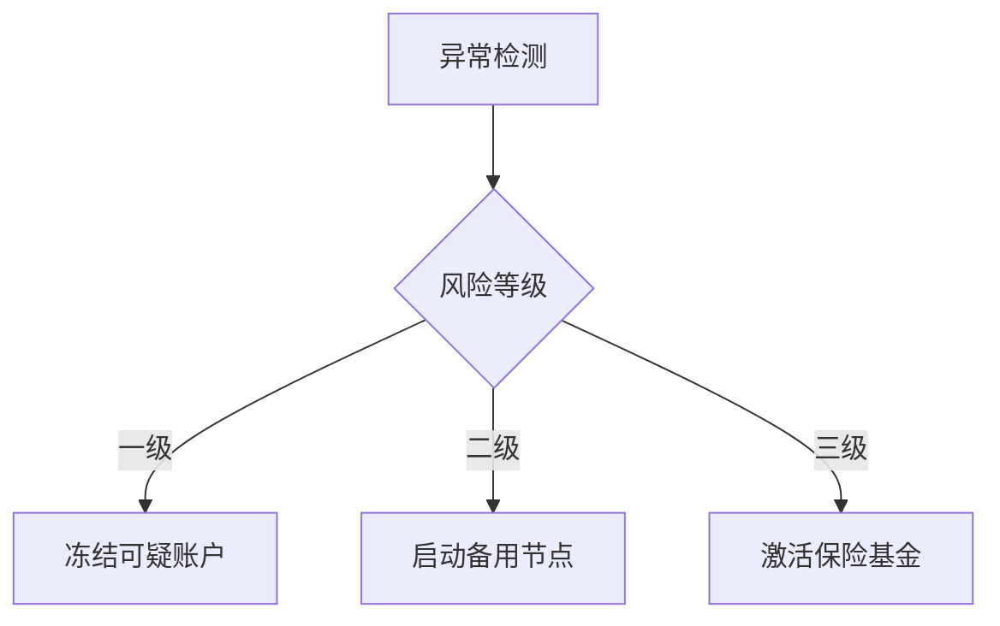

# 欧易OKX：全球领先的数字货币交易平台详解

## 平台核心优势概览
作为全球头部数字资产交易平台，欧易OKX凭借多重技术优势与创新功能，为用户提供安全、高效的交易体验。平台核心优势涵盖原生代币体系、智能交易系统、资产安全保障及Web3生态布局四大维度，以下将展开深度解析。

---

## OKB代币：平台生态价值中枢
作为欧易OKX平台发行的原生代币，OKB已构建起完整的应用场景生态：
- **交易费用减免**：用户持有OKB可享受最高50%的交易手续费折扣，具体折扣比例与持仓量挂钩（例：持有5000OKB享20%折扣，10000OKB享35%折扣）
- **生态权益凭证**：参与平台首发项目（IEO）、NFT盲盒抽签、流动性挖矿等增值服务的准入资格
- **治理投票权**：对平台新功能开发、上币提案等重大决策拥有投票权

👉 [立即获取OKB代币最新权益说明](https://bit.ly/okx_welcome)

| 持仓等级 | 手续费折扣 | 年化理财收益率加成 | 专属客服服务 |
|---------|------------|-------------------|-------------|
| 普通用户 | 0%         | 0%                | 无          |
| 钻石会员 | 50%        | 8%                | VIP专属通道 |

---

## 智能交易系统：闪兑功能深度解析
欧易OKX创新推出的闪兑功能采用智能做市商模式，实现零滑点交易体验：

### 运作机制
1. 用户输入目标交易对与数量
2. 系统实时聚合10+主流交易所深度数据
3. 生成包含最优价格与执行路径的报价单
4. 用户确认后立即锁定价格完成交易

### 核心优势对比
| 对比维度   | 传统现货交易       | 闪兑功能          |
|------------|--------------------|-------------------|
| 手续费率   | 0.1%-0.2%          | 0手续费           |
| 滑点控制   | 0.5%-3%            | 0滑点            |
| 执行速度   | 1-3秒              | 0.3秒极速成交     |
| 价格透明度 | 盘口价实时波动     | 事前确认固定价格  |

👉 [体验零滑点闪兑交易](https://bit.ly/okx_welcome)

---

## 资产安全保障体系
平台构建五层防护体系保障用户资产安全：

### 安全架构详解
1. **冷热钱包隔离**：98%资产存于离线冷钱包，采用军用级加密存储
2. **多重签名技术**：每笔提币需通过3/5门限签名验证
3. **AI风控系统**：实时监控异常交易行为，毫秒级响应
4. **保险基金池**：动态计提0.1%交易额作为风险保障金
5. **储备金审计**：每月发布Merkle Tree证明，用户可随时验证资产储备

### 安全事件应对流程

---

## Web3生态布局：多链钱包解决方案
欧易Web3钱包已构建完整基础设施：
- **跨链支持**：兼容BTC/ETH/TRON等130+主流公链
- **子钱包管理**：单账户支持创建1000个隔离式子钱包
- **DApp生态**：集成DeFi、NFT、GameFi等300+个应用入口

### 多链资产管理对比
| 功能维度   | 单链钱包          | 欧易多链钱包        |
|------------|-------------------|---------------------|
| 链切换     | 手动切换应用       | 一键跨链资产聚合    |
| 私钥管理   | 独立存储           | 统一助记词管理      |
| 交易记录   | 分散查询           | 统一交易视图        |
| Gas费支付  | 需单独储备各链原生币 | 自动兑换Gas费用     |

👉 [立即体验多链钱包管理](https://bit.ly/okx_welcome)

---

## 储备金证明：透明化运营实践
平台通过区块链技术实现资产透明化：
1. **实时验证**：用户可通过Merkle Tree验证个人资产对应储备
2. **第三方审计**：聘请安永会计师事务所进行季度储备审计
3. **动态披露**：每日更新链上钱包地址，资产流向可追溯

### 典型验证流程
1. 访问链上验证页面
2. 输入账户资产余额
3. 系统生成对应Merkle Proof
4. 核对区块链浏览器确认储备

---

## 常见问题解答（FAQ）
### Q1：如何计算OKB抵扣手续费的实际收益？
A：以日均交易量10BTC为例，普通用户年手续费约$7200，钻石会员仅需$3600，年省$3600+。

### Q2：闪兑功能是否支持法币交易？
A：当前支持USDT/USDC等主流稳定币与主流币种互换，法币通道正在灰度测试中。

### Q3：冷钱包资产提现已采取哪些验证措施？
A：需经过短信验证+谷歌验证+生物识别三重验证，且单日提币额超过$50万需人工审核。

### Q4：Web3钱包能否导入其他平台资产？
A：支持MetaMask、TrustWallet等主流钱包资产一键迁移，已实现地址互通。

---

## 邀请奖励计划：共享平台红利
欧易OKX推出阶梯式奖励机制：
- **基础奖励**：邀请好友交易享10%手续费返佣
- **进阶奖励**：团队月交易额达$100万享额外5%奖励
- **专属福利**：VIP邀请人专属活动优先参与权

### 奖励计算示例
| 邀请层级 | 有效邀请人数 | 享手续费返佣比 | 额外奖励权益          |
|----------|--------------|----------------|-----------------------|
| 普通用户 | 0-9人        | 10%            | 无                    |
| 钻石大使 | 10-49人      | 15%            | 月度空投资格          |
| 皇冠大使 | 50人+        | 20%            | 定制化营销资源支持    |

👉 [立即获取专属邀请计划](https://bit.ly/okx_welcome)